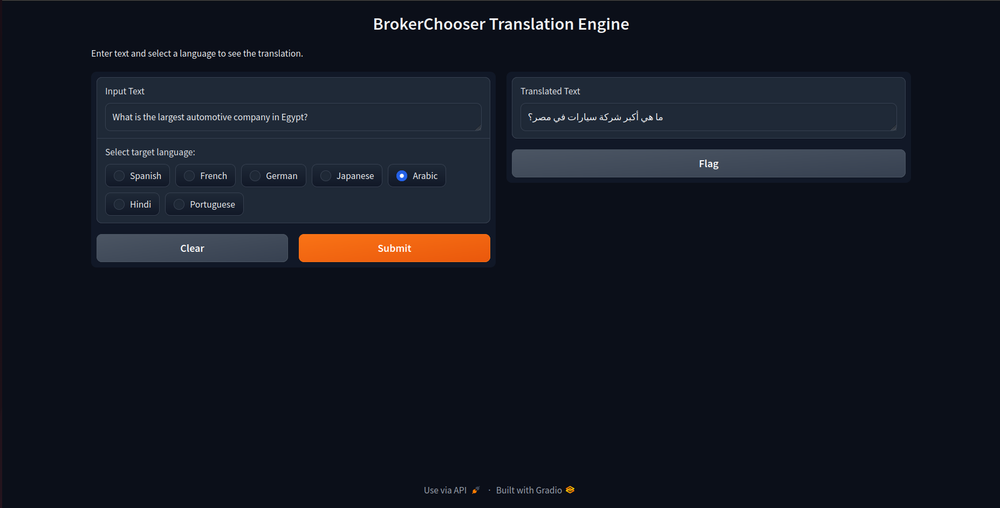
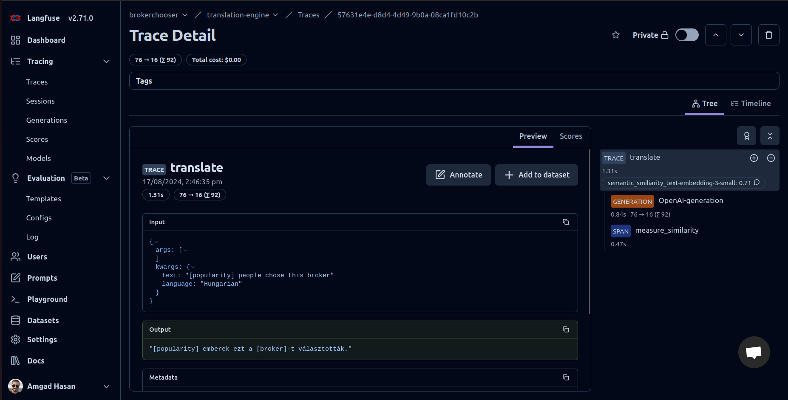

# financial-translation
A translation engine for financial applications.


## Setup
### Dependencies
Install the dependcies:
```bash
# Create a virtual environment
# python3 -m venv .venv && source .venv/bin/activate
pip install -r requirements.txt
```
### Set up environment variables
Set up your environment variables in a file named `.env`
```bash
cp .example.env .env
```

### Running the webapp:
```bash
python3 src/main.py --host 0.0.0.0 --port 8080
```

Go to http://0.0.0.0:8080

## Docker
Alternatively, you can run using docker
### Build
```bash
docker build . -t financial-translation
```

### Create env file
```bash
cp .example.env .env
```

### Run container
```bash
docker run --env-file .env -p 8080:8080 financial-translation
```

Go to http://localhost:8080

## Evaluation
For evaluation, we use 3 metrics:
1. Bleu score: This is the industry standard for measuring translation accuracy. It is a rule-based metric that measures n-gram overlap. We use `sacrebleu` reference implementation. Higher is better
2. TER score: This is a rule-based metric that measures the amount of editing that a translator would have to perform to change a translation so it exactly matches a reference translation.
3. Semantic similarity: This is a recent metric that measures the semantic smiliarity (i.e. how similar in meaning) between the predicted translation and the reference translation. It uses an embedding model to calculate embeddings for both the prediction and the label and then we measure the cosine similarity between theses embeddings. This is model-based metric that is much more computational expensive. It doesn't rely on matching words or strings so should understand that "booking" and "reservation" are similar, unlike rule-based metrics.

To evaluate a model on a labeled test set, the test set should be a csv file with a column containing the inputs and another column containing the labels (aka the ground-truth translation).

To run evaluation and use OpenAI model for prediction:
```bash
python src/eval.py --file path/to/test_set.csv --input-column name_of_input_column --label-column name_of_output_column --language target_language --openai-model gpt-4o-mini
```

To run evaluation where predictions already exist:
```bash
python src/eval.py --file path/to/test_set.csv --input-column name_of_input_column --label-column name_of_output_column --language target_language --prediction-column google_translate
```

### Docker
Run the following commands with the correct arguments for  `--volumne` `--input-column` `--label-column` `--language`
```bash
docker run --volume path/to/test_set.csv:/test.csv --env-file .env -p 8080:8080 financial-translation python3 src/eval.py --file /test.csv --input-column input-column-name --label-column label-column-name --language language --openai-model gpt-4o-mini
```

```bash
docker run --volume path/to/test_set.csv:/test.csv --env-file .env -p 8080:8080 financial-translation python3 src/eval.py --file /test.csv --input-column input-column-name --label-column label-column-name --language language --prediction-column google_translate
```

## Tracing
This project uses langfuse for LLM tracing. It traces inputs, model outputs, token usage, cost, latencies and more.

